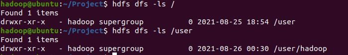
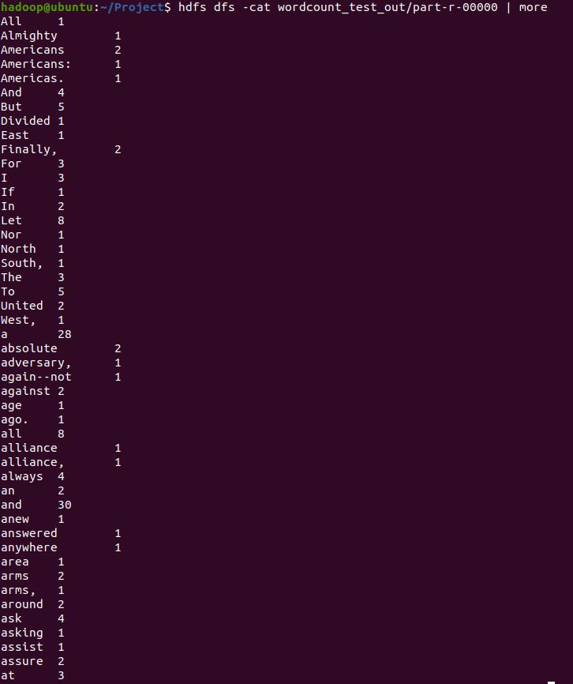
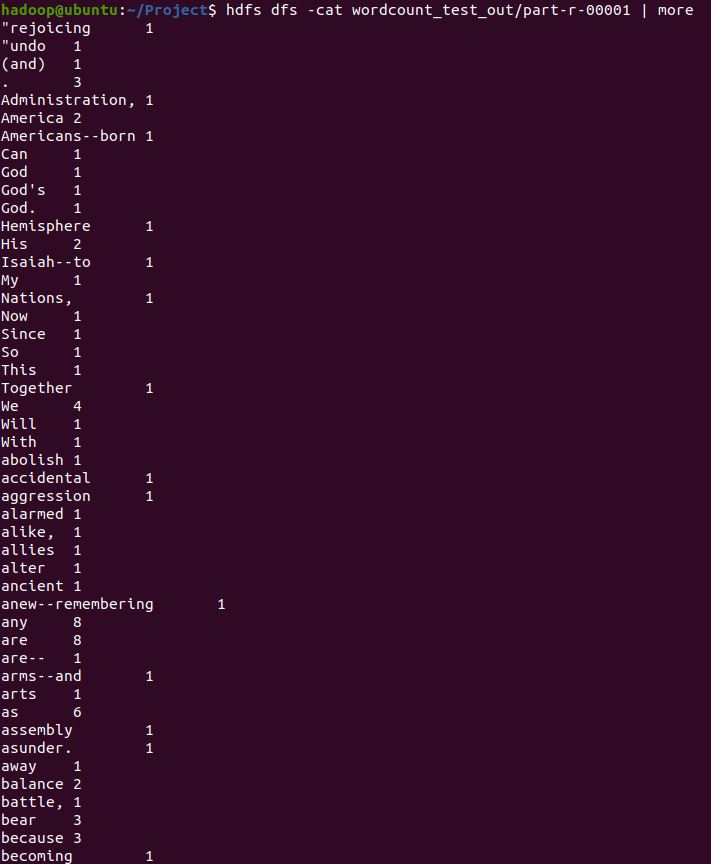

# 개발 환경 구성

- Windows에 VMware Workstation 설치
- <https://www.vmware.com/products/wordstation-player.html>

# 우분투 설치

- VMware Workstation에서 사용할 리눅스(Ubuntu) 설치
- <http://www.ubuntu.com/download/ubuntu/download>

# Hadoop 실행 준비

# 맵 리듀스 예제 수행

- hdfs dfs -cat wordcount_test_out/part-r-00000 | more 결과

- hdfs dfs -cat wordcount_test_out/part-r-00001 | more 결과

