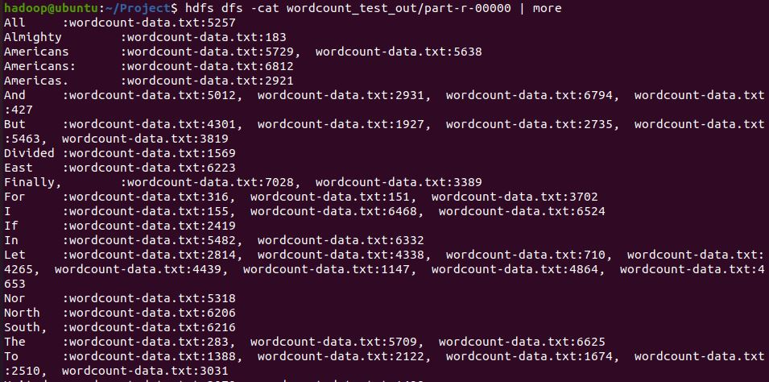
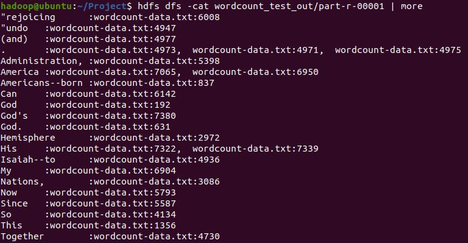

# 프로젝트#3

## InvertedIndex.java

단어가 나온 곳의 주소를 알아내는 프로젝트


```java
import java.io.IOException;
import java.util.StringTokenizer;

import org.apache.hadoop.conf.Configuration;
import org.apache.hadoop.fs.Path;
import org.apache.hadoop.fs.FileSystem;
import org.apache.hadoop.io.IntWritable;
import org.apache.hadoop.io.LongWritable;
import org.apache.hadoop.io.Text;
import org.apache.hadoop.mapreduce.Job;
import org.apache.hadoop.mapreduce.Mapper;
import org.apache.hadoop.mapreduce.Reducer;
import org.apache.hadoop.mapreduce.lib.input.FileInputFormat;
import org.apache.hadoop.mapreduce.lib.input.FileSplit;
import org.apache.hadoop.mapreduce.lib.output.FileOutputFormat;
import org.apache.hadoop.util.GenericOptionsParser;

public class InvertedIndex {
	/* 
	Object, Text : input key-value pair type (always same (to get a line of input file))
	Text, IntWritable : output key-value pair type
	*/
	public static class TokenizerMapper
			extends Mapper<Object,Text,Text,Text> {
			
		private Text word = new Text();
		private Text result = new Text();
		
		private String filename;
		protected void setup(Context context) throws IOException, InterruptedException {
			filename = ((FileSplit)context.getInputSplit()).getPath().getName();
		}
		
		// variable declairations
		
		
		// map function (Context -> fixed parameter)
		public void map(Object key, Text value, Context context)
				throws IOException, InterruptedException {

			// value.toString() : get a line
			StringTokenizer itr = new StringTokenizer(value.toString()," ",true);
			long p = ((LongWritable)key).get();
			while ( itr.hasMoreTokens() ) {
			
				String temp = itr.nextToken();
				word.set(temp.trim());
				
				if(!temp.equals(" ")){
					result.set(filename+":"+p);
					context.write(word,result);
				}
				
				p += temp.length();
			}
		}
	}
	
	
	
	/*
	Text, IntWritable : input key type and the value type of input value list
	Text, IntWritable : output key-value pair type
	*/
	public static class ConcatenatorReducer
			extends Reducer<Text,Text,Text,Text> {

		// variables
		private Text list = new Text();

		// key : a disticnt word
		// values :  Iterable type (data list)
		public void reduce(Text key, Iterable<Text> values, Context context) 
				throws IOException, InterruptedException {

			String s = new String();
			int comma = 0;
			for ( Text val : values ) {
				if(comma == 0){
					comma = 1;
					s += (":" + val.toString());
				} else{
					s += (",  " + val.toString());
				}
			}
			list.set(s);
			context.write(key,list);
		}
	}


	/* Main function */
	public static void main(String[] args) throws Exception {
		Configuration conf = new Configuration();
		String[] otherArgs = new GenericOptionsParser(conf,args).getRemainingArgs();
		if ( otherArgs.length != 2 ) {
			System.err.println("Usage: <in> <out>");
			System.exit(2);
		}
		
		FileSystem hdfs = FileSystem.get(conf);
		Path output = new Path(otherArgs[1]);
		if(hdfs.exists(output))
			hdfs.delete(output,true);
		
		Job job = new Job(conf,"inverted index");
		job.setJarByClass(InvertedIndex.class);

		// let hadoop know my map and reduce classes
		job.setMapperClass(TokenizerMapper.class);
		job.setReducerClass(ConcatenatorReducer.class);

		job.setOutputKeyClass(Text.class);
		job.setOutputValueClass(Text.class);

		// set number of reduces
		job.setNumReduceTasks(2);

		// set input and output directories
		FileInputFormat.addInputPath(job,new Path(otherArgs[0]));
		FileOutputFormat.setOutputPath(job,new Path(otherArgs[1]));
		System.exit(job.waitForCompletion(true) ? 0 : 1 );
	}
}
```


## 결과




