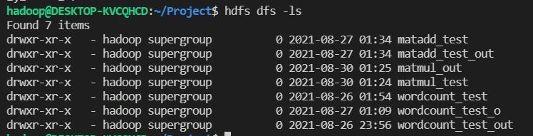
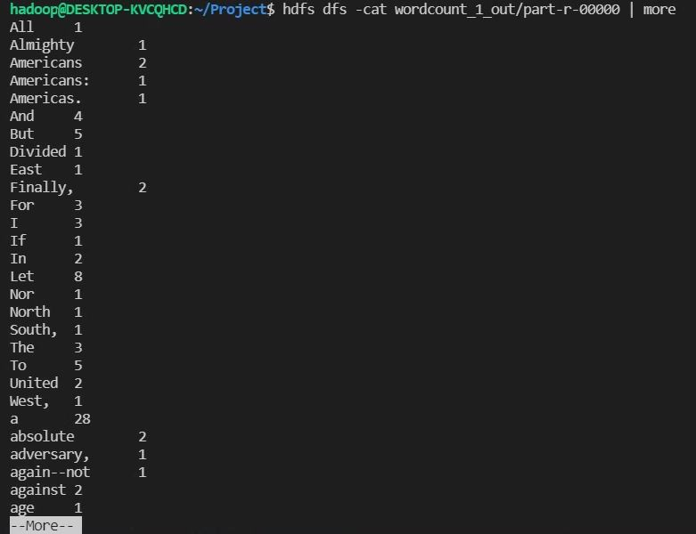

# 환경설정
* [WSL 2 설치](https://docs.microsoft.com/ko-kr/windows/wsl/install-win10)
  * repo 오류 나므로 한번 재부팅
    * powershell에서 wsl --shutdown
  * 재부팅 하면 ssh 포트 오류도 해결됨

* HDFS 정상 실행 확인 & 디렉토리 확인
 

* 1강: WordCount 결과
 
