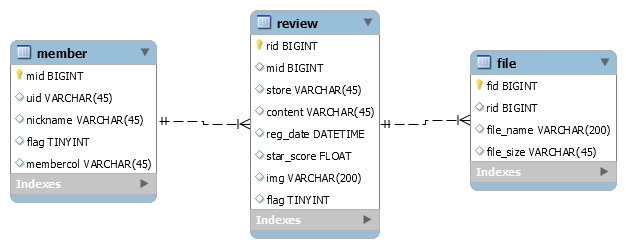

# SUB2
* __주제__
    * 맛집 리뷰 분석
        - 감성 분석
        - 연관어 분석
        - 맛집 비교 분석

* __기획__
    * 와이어프레임
    * ERD
    
    

* __사전학습__
    * [프로젝트 1](./프로젝트1)
    * [프로젝트 2](./프로젝트2)
    * [프로젝트 3](./프로젝트3)
    
* __이외의 학습__
    * [하둡 학습](./학습/하둡)
    * [Redis 학습](./학습/레디스)
    * [네이버 크롤링](./학습/네이버 크롤링)
    * [트위터 크롤링](./학습/트위터 크롤링)
    * [감성분류](./학습/리뷰 감성분류)
    * [Elasticsearch](./학습/엘라스틱서치)

* __Reference__
    * [하둡 유튜브](https://www.youtube.com/playlist?list=PL9mhQYIlKEheGLT1V_PEby_I9pOXr1o3r)
    * [하둡 링크](https://github.com/hyunjun/bookmarks/blob/master/hadoop.md)
    * [빅데이터 - 하둡, 하이브 시작하기](https://wikidocs.net/22936)
    
