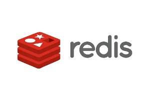

# Redis

## 1장 Redist 이해

### Redis 란 무엇인가?

- 대용량 데이터 처리 관련 기술 중 하나 (NoSQL, Cache, Redis, Memcache, Sharding)
- 속도를 빠르게 하기 위한 "캐시(Cache) 솔루션" + NoSQL 의 Key-Value 스토어
- 사용하기 쉽고, 속도가 빠르다

| 항목        | 내용                                                     |
| ----------- | -------------------------------------------------------- |
| 홈페이지    | http://redis.io                                          |
| 소스 저장소 | https://github.com/antirez/redis                         |
| 기본 명령어 | http://redis.io/commands                                 |
| 최신버전    | 6.2.5 (latest stable version)                            |
| 로고        |  |

### Redis의 주요 특성

- Redis의 주요 특성

| 항목             | 내용                                                         |
| ---------------- | ------------------------------------------------------------ |
| Key-Value 스토어 | 단순 스트림에 대한 Key/Value(키/벨류) 구조를 지원            |
| 컬렉션 지원      | List, Set, Sorted Set, Hash 등의 자료 구조를 지원            |
| Pub/Sub 지원     | Publish/Subcribe 모델을 지원                                 |
| 디스크 저장      | 현재 메모리 상태를 디스크로 저장할 수 있는 기능, 업데이트 명령어 저장 기능(AOF) |
| 복제             | 다른 노드에 현재 노드의 내용을 저장할 수 있는 마스터/슬레이브 구조를 지원 |
| 빠른 속도        | 초당 100,000QPS(Queries Per Second) 수준의 높은 성능         |

- Key-Value 스토어

  - 기본적으로 Redis는 Key-Value 형태의 저장소이다. 아래와 같이 간단한 명령어를 이용해 데이터를 저장할 수 있다.

    > $>set id:username "username"
    >
    > $>set id:email test@test.com
    >
    > $>get id:username

- 컬렉션 지원

  - Redis를 이용하면 컬렉션을 분산 서버 환경에서 처리할 수 있어서 서비스 설계, 구현에 있어서 많은 이점을 얻을 수 있다. 

- Pub/Sub 지원
  - 서버간 통지가 필요할 때 유용하다
- 디스크 저장
  - RDB: 현재의 메모리 상태를 디스크에 저장하는 기능이다. 현재의 상태를 스냅샷으로 저장할 뿐 다른 기능은 없지만, 이렇게 덤프한 내용을 다시 메모리에 올려 사용할 수 있다.
  - AOF: Append Only File, set/del 등의 업데이트 명령을 받으면 명령어를 그대로 저장한다.
  - Redis는 가능하면 두 개를 다 사용하는 것이 좋다고 하지만, 디스크에 저장하는 만큼 성능 손실은 어느 정도 감수해야 한다
- 복제
  - Redis는 Master/Slave Replication을 지원한다.
  - 마스터에서 장애가 발생하면 슬레이브로 서비스를 하거나 마스터의 부하가 많을 때는 슬레이브를 이용해서 읽기를 처리할 수 있다.

### Redis와 Memcached 비교

- Memcached는 캐시 솔루션이고 여기에 저장소의 개념이 추가된 것이 Redis 이다.
- 이외에도 Redis에는 컬렉션이라는 자료구조를 제공하므로, 개발의 생산성 측면에서 볼 때 더 좋다.

| 분류            | Redis                                       | Memcached            |
| --------------- | ------------------------------------------- | -------------------- |
| 속도            | 초당 100,000QPS 이상                        | 초당 100,000QPS 이상 |
| 자료구조        | Key-Value, List, Set, Hash, Sorted Set 지원 | Key-Value 만 지원    |
| 안정성          | 특성을 잘못 이해한 경우, 프로세스 장애 발생 | 장애 거의 없음       |
| 응답속도 균일성 | Memcached에 비해 균일성이 떨어질 수 있음    | 전체적으로 균일함    |

- 응답속도의 균일성 : 대규모 트래픽으로 인해 많은 데이터가 업데이트가 되면, Redis는 Memcached에 비해서 속도가 출렁인다. 이것은 Redis와 Memcached의 메모리 할당 구조가 다르기 때문이다.
- Redis는 jemalloc을 사용하는데, 매번 malloc과 free를 통해서 메모리 할당이 이루어진다.
- Memcached는 slab 할당자를 이용하여, 내부적으로 메모리 할당을 다시 하지 않고 관리하는 형태를 취한다.
- 이로 인해서 Redis는 메모리 프래그멘테이션 등이 발생하며 이 할당 비용 때문에 응답 속도가 느려진다. 다만, 이는 극단적으로 봤을 때 발생하는 일이다. 거의 문제가 발생하지 않는다.

### Redis 설치해서 사용하기

- 리눅스에서 설치하는 것을 기준으로 설명하겠다.

1. apt-get 업데이트 & make & gcc 설치

   ```
   $ apt-get update
   $ apt-get install gcc
   $ apt-get install make
   ```

2. Redis 설치 (다운로드, 압축풀기, 빌드)

   ```
   $ wget https://download.redis.io/releases/redis-6.2.5.tar.gz
   $ tar xzf redis-6.2.5.tar.gz
   $ cd redis-6.2.5
   $ make
   ```

3. Redis 실행 & CLI 접속

   ```
   $ src/redis-server
   $ src/redis-cli
   ```

