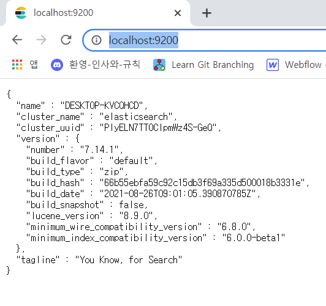
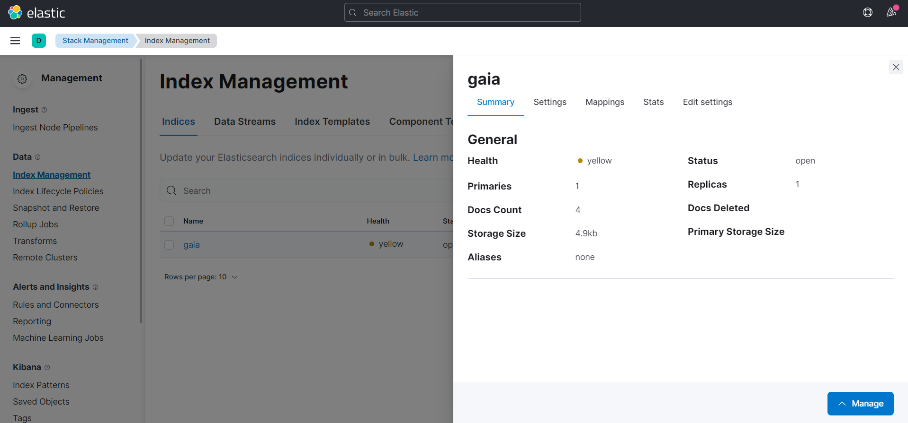
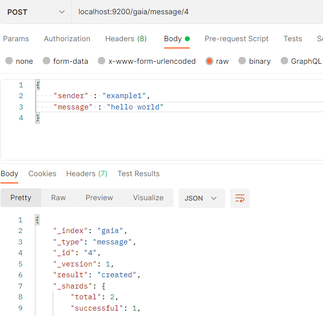
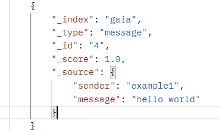
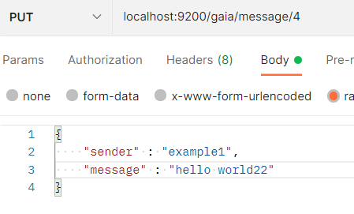
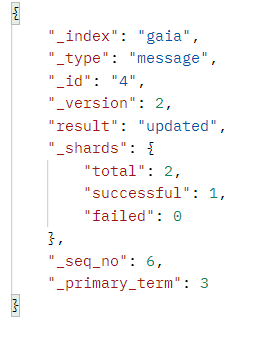
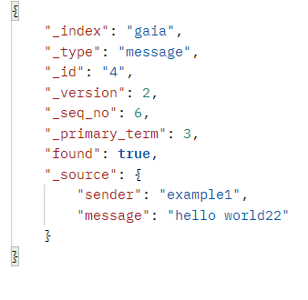
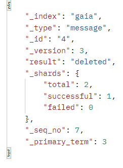
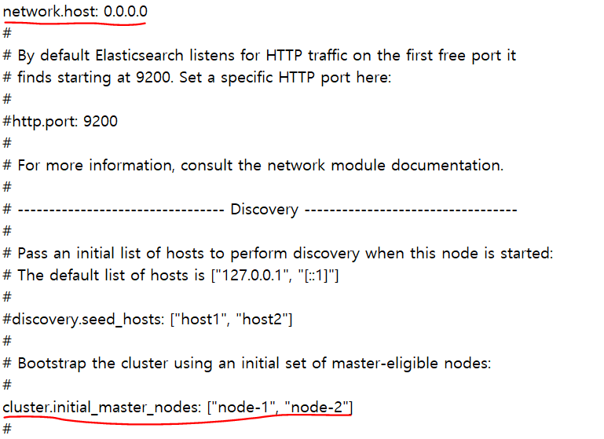

# ElasticSearch


#### 다운로드 및 설치

---


##### 1. elastic

- 다운로드 링크 : https://www.elastic.co/downloads/elasticsearch

- bin/elasticsearch.bat 실행

[실행 후 화면 : localhost:9200]



##### 2. kibana

- 다운로드 링크 : https://www.elastic.co/kr/downloads/kibana
- kibana.yml파일의 server.host: "0.0.0.0"
  - "" 꼭 쓰고 : 뒤에 한 칸 띄어쓰기 필요
- bin/kibana 실행

[실행 후 화면 : localhost:5601]




<br><br>


#### CRUD 예제

---


**1. Elastic vs RDBMS**

| Elastic  | RDBMS    |
| -------- | -------- |
| Index    | Database |
| Type     | Table    |
| Document | row      |
| Field    | column   |
| Mapping  | schema   |


**2. POST**



gaia 인덱스의 message 타입에 4라는 아이디로 저장했다는 의미이다.


**3. GET**




_search로 다음과 같은 결과를 얻을 수 있다.

message가 "hello world" 인 데이터만 얻고 싶으면

```
localhost:9200/gaia/message/_search?q=message:"hello world"
```

라고 입력하면 된다.


**4. PUT**





PUT을 통해 데이터를 수정하면 다음과 같은 메세지가 나온다.

다시 gaia/message/4 의 데이터를 조회하면



다음과 같이 message 가 수정된 것을 확인할 수 있다.


**5. DELETE**




gaia 인덱스의 message 타입이 4인 데이터를 삭제한다는 의미이다. 성공적으로 데이터를 삭제하면 위와 같은 메세지를 얻을 수 있다.


<br><br>

#### 외부 접속 허용

---


elasticsearch.yml 파일의 network.host 를 0.0.0.0으로 변경하고 cluster.initial_master_nodes의 주석을 풀어준다.




※ No 'Access-Control-Allow-Origin' 에러 해결을 위한 조치

```
http.cors.enabled: true 
http.cors.allow-origin: "*"
```

위의 두 줄을 elasticsearch.yml에 추가 


<br><br>

#### python & elasticsearch

---


```
pip install elasticsearch

from elasticsearch import Elasticsearch
```

elasticsearch를 설치하고 import 한다.


```
es = Elasticsearch('localhost:9200')
    
es.index(index="msg", doc_type="store", body=store)
```

elastic이 설치된 서버 주소와 포트를 입력하면 python과 연결이 된다.

.index를 사용하면 인자값으로 설정한 index, type, body ( (RDMBS 기준) database, table, data )가 elastic db에 저장된다.


<br><br>

#### spring & elasticsearch

---


```
ElasticUtil elastic = ElasticUtil.getInstance();

String index = "msg";

Map<String,Object> query = new HashMap<>();
query.put("name","경남반점");

List<Map<String, Object>> list = elastic.simpleSearch(index, query);
```

ElasticUtil을 통해 elastic 서버와 연결하고 적절한 index와 쿼리문(쿼리문이 없을 시 index에 있는 모든 데이터를 반환한다.)을 simpleSearch에 넘겨주면 조건에 해당하는 데이터를 반환한다.

<br><br>

### 테스트 예제

---

```
localhost:9200/msg/test/_count?q=name:롯데리아
localhost:9200/msg/test/_search?q=name:*데리*
localhost:9200/realtime/top/_search?sort=cnt:desc
```
<br><br>
