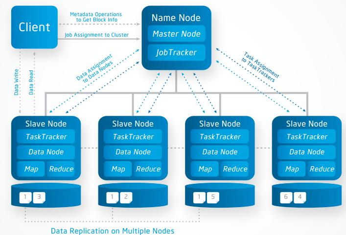
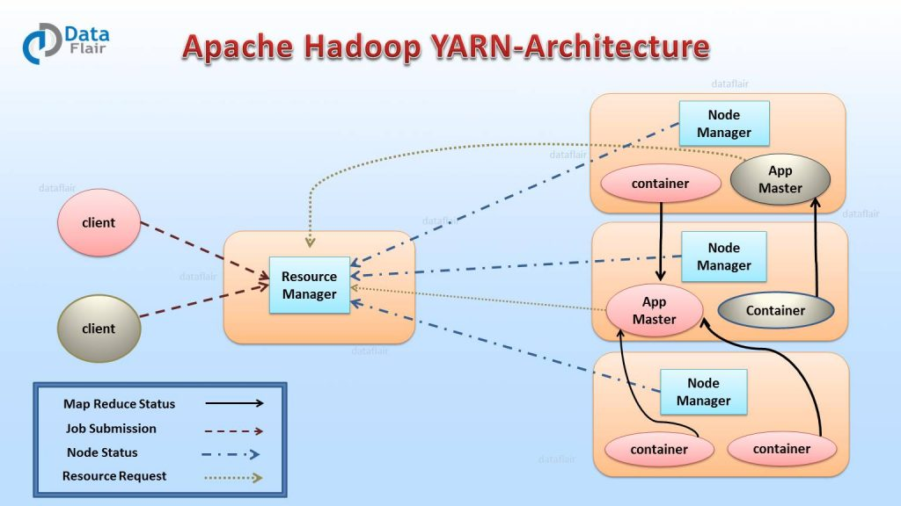

## 하둡

- Hadoop  

  - 하둡은 2006년 야후의 더그 커팅이 '넛치'라는 검색엔진을 개발하는 과정에서 대용량의 비정형 데이터를 기존의 RDB 기술로는 처리가 힘들다는 것을 깨닫고, 새로운 기술을 찾는 중 구글에서 발표한 GFS와 MapReduce 관련 논문을 참고하여 개발하였습니다. 이후 아파치 재단의 오픈 소스로 공개 되었습니다.

  - 하둡은 하나의 성능 좋은 컴퓨터를 이용하여 데이터를 처리하는 대신, 적당한 성능의 범용 컴퓨터 여러 대를 클러스터화하고, 큰 크기의 데이터를 클러스터에서 **병렬로 동시에 처리**하여 처리 속도를 높이는 것을 목적으로 하는 **분산처리를 위한 오픈소스 프레임워크**라고 할 수 있습니다.

- 하둡의 구성 요소

  - Hadoop Common
    - 하둡의 다른 모듈을 지원하기 위한 공통 컴포넌트 모듈
  - Hadoop HDFS
    - 분산저장을 처리하기 위한 모듈
    - 여러개의 머신을 하나의 머신의 파일시스템 처럼 사용
  - Hadoop YARN
    - 병렬처리를 위한 클러스터 자원관리 및 스케줄링 담당

- 하둡의 장점

  - 오픈소스로 라이선스에 대한 비용 부담이 적음
  - 시스템을 중단하지 않고, 장비의 추가가 용이(Scale Out)
  - 일부 장비에 장애가 발생하더라도 전체 시스템 사용성에 영향이 적음 (Fault tolerance)
  - 저렴한 구축 비용과 비용 대비 빠른 데이터 처리 능력
  - 오프라인 배치 프로세싱에 최적화

- 단점

  - HDFS에 저장된 데이터를 변경 불가
  - 실시간 데이터 분석같은 신속하게 처리해야 하는 작업에는 부적합
  - 설정의 어려움

## 하둡 버전별 특징

### Hadoop V1

- 2011년에 정식 발표된 하둡 v1은 분산저장, 병렬처리 프레임워크를 정의하였습니다.

- **분산저장**은 **네임노드와 데이터노드**가 처리합니다. 네임노드는 블록정보를 가지고 있는 메타데이터를 관리하고, 데이터 노드를 관리하는 역할을 합니다. 데이터노드에서 데이터를 블록단위로 나누어서 저장합니다. 블록단위 데이터는 복제하여 데이터 유실에 대비합니다.

- **병렬처리**는 **잡트래커**와 **태스크트래커**가 담당한다. 잡트래커는 전체 진행상황을 관리하고 자원관리도 처리합니다. 테스크트래커는 실제 작업을 처리하는 일을 합니다. 이때 병렬처리의 작업단위는 슬롯으로 맵 슬롯과 리듀스 슬롯이 있습니다. 병렬처리를 통해 클러스트당 최대 4000개의 노드를 등록가능합니다.

- |  구분  |   HDFS    |  MapReduce   |
  | :----: | :-------: | :----------: |
  | Master | Name Node | Job Tracker  |
  | Slave  | Data Node | Task Tracker |

- Master Node : Slave node 정보저장(Name Node) 및 실행할 Task 관리(Job Tracker) 역할

- Slave Node : 데이터를 분산하여 가지고 있으며 Client에서 요청이 오면 데이터를 전달(Data Node)하는 역할 및 담당 Task를 수행(Task Tracker)하는 역할

- Client : Name Node를 통해 정보를 받고 이후 직접적으로 Data Node와 통신

  

  

  ### HDFS: 클러스터에 Data 저장

  > Data는 block단위로 클러스터의 여러 노드에 분산하여 저장되고, 각 block은 여러개의 **Replication(기본 3개)**을 생성해 서로 다른 노드에 저장
  >
  > 파일을 HDFS에 저장할 때, 파일은 block size 단위(default 64mb)로 나뉘어 노드들에 분배되어 저장됩니다. block size는 최대 128mb까지 늘릴 수 있습니다.
  >
  > 1GB 파일을 HDFS에 저장한다고 하면 16개(1024/64)로 나뉘어 저장이 됩니다.
  >
  > 만약 4개의 Node가 있다고 가정을 하면 각 노드에 4개씩 저장이 되거나 가용성, 노드밸런스 등 다른 요인에 따라 5.5.3.3 같이 저장될 수 있습니다.

  **Name Node**

  네임 노드는 hadoop master/slave 아키텍처에서 master 역할이고, data 가 어떤 노드에 저장되어 있는 지를 metadata 안에 가지고 있습니다.

  - HDFS 파일/디렉토리에 대한 meta data 유지
  - 클라이언트로부터 데이터 위치 요청이 들어오면 전달
  - 장비 손상시 Secondary Node로 대체

  **Data Node**

  - 데이터를 HDFS의 Block 단위로 저장
  - Fault Recovery를 위해 Replication을 유지
  - Heartbeat를 통해 지속적으로 파일 위치 전달

  **Replication**

  1GB를 HDFS로 저장해서 16개로 나뉘어 진다면 복사본까지 총 48개의 블록이 저장이 되고, 만약 원본의 rack of node가 실패하면 복사본 데이터가 실행가능한 상태가 된다.

  **Secondary Name Node**

  하둡이 비정상 종료를 하면 모든 metadata들을 잃습니다. 이 경우에서 회복하기 위해선 metadata가 필요한대, Scondary Name Node가 이 상황을 해결해 줄 수 있습니다.

  - 네임 노드는 metadata를 fsimage라는 곳에 저장하는데, Secondary Name Node는 이fsimage를 정해진 주기마다 복사합니다. (중요한 프로그램인 경우 주기를 2분이나 더 적게 할 수 있습니다)
  - Secondary Name Node는 백업 노드가 아닌 helper 노드 입니다, Name Node가 다운되기 직전에 fs image를 복사한게 아니라면 여전히 데이터는 잃습니다.
  - Secondary Name Node는 edits log 파일에 fsimage 정보를 업데이트 합니다. 그리고 이 edits log 파일은 네임 노드가 다시 실행될때 metadata를 복구시키기 위해 상용됩니다.
  - Secondary Name Node는 네임 노드의 자리를 대신하는게 아니라, 네임 노드가 실패했을 때를 대비해서 metadata를 가지고 있는 겁니다.

  #### MapReduce: 클러스터의 Data를 처리하기 위한 시스템

  > Map과 Reduce 사이에는 ***Shuffle과 Sort\* 스테이지**가 존재하며, 각 Map task는 전체 데이터 셋에 대해 별개의 부분에 대한 작업 수행

  **Job Tracker**

  client로부터 job을 받고 free한 task tracker에서 task를 배정해 줍니다. 또한 task tracker 들이 매 액션마다 job tracker에게 heart beat를 보내는 걸로 모니터링을 합니다.

  특정한 DataNode로 부터 긴 시간동안 heart beat를 받지 못하면, 다운된 걸로 처리해서 다른 DataNode에 같은 task를 배정하고 이전 task는 kill합니다.

  - 여러 Job을 수행하면서 성공적으로 끝날 때 까지 관리를 해주고, 스케쥴링과 모니터링을 담당한다
  - 클러스터의 자원 관리

  **Task Tracker**

  - Task는 *Map Task* 와 *Reduce Task* 로 나누어짐
  - Task가 위치한 HDFS의 데이터를 사용하여 MapReduce 수행

  병렬처리의 작업(Task) 단위는 *슬롯 (Slot)*이다. 맵 슬롯, 리듀스 슬롯의 개수가 정해져있고, **실행시점에 역할이 정해지면 슬롯의 용도를 변경할 수 없기 때문에** 맵 작업 진행중일 때 리듀스 슬롯은 대기상태로 있었다. 때문에 클러스터가 100% 활용되지 않을 때도 있었다.

  

  > 이러한 Hadoop v1은 병렬처리의 **클러스터 자원관리, 애플리케이션 라이프사이클 관리를 Job Tracker가 모두 담당**하여 병목현상이 발생했다. 이러한 병목현상을 개선하기 위해 Hadoop v2에서 YARN 아키텍처를 도입했다.

### Hadoop V2

> Job Tracker의 병목현상을 개선하기 위해 **YARN 아키텍처를 도입**했다. 이를 통해 배치/인터렉티브/스트림과 같이 다양한 데이터 처리가 가능해졌다.
>
> **YARN**은 기존의 Job Tracker의 기능을 분리하여 클러스터의 자원관리는 **리소스 매니저**가, 애플리케이션 라이프 사이클 관리는 **애플리케이션 마스터**가, AM 실행 컨테이너 관리는 **노드매니저**가, 작업의 처리는 **컨테이너**가 담당하도록 하였다.

- YARN 아키텍처의 작업의 처리 단위는 **컨테이너**입니다.
- 작업에 제출되면 애플리케이션 마스터가 생성되고, 애플리케이션 마스터가 리소스 매니저에 자원을 요청하여 실제 작업을 담당하는 컨테이너를 할당받아 작업을 처리합니다.    
- 컨테이너는 작업이 요청되면 생성되고, 작업이 완료되면 종료되기 때문에 클러스터를 효율적으로 사용할 수 있습니다.

- 또한 YARN 아키텍처에서는 MR로 구현된 작업이 아니어도 컨테이너를 할당 받아서 동작할 수 있기 때문에 Spark, HBase, Storm 등 다양한 컴포넌트들을 실행할 수 있습니다.

  

  **리소스 매니저 (Resource Manager, RM)**

  리소스 매니저는 클러스터에 1개만 존재하며, 클러스터의 자원 관리와 Task 스케줄링이 메인 역할입니다.

  > client가 애플리케이션 실행 요청을 하면 RM이 애플리케이션 마스터를 실행하고, 노드 매니저와 통신하여 자원 상황을 알아내고, App master와 통신하여 필요한 자원이 무엇인지 알아내서 관리합니다.	

  

  **노드 매니저 (Node Manager, NM)**

  - 노드당 1개씩 존재하며, yarn의 Slave daemon이다. 컨테이너 자원을 모니터링하고 리소스 매니저에게 자원 상황을 보고하는 역할을 한다. 
  - 리소스 매니저의 지시를 받아 작업 요구에 따라 컨테이너를 생성한다.

  

  **애플리케이션 마스터 (Application Master, AM)**

  애플리케이션 당 1개씩 생성되며, RM 스케줄러로 부터 적절한 컨테이너를 할당 받고, 애플리케이션의 실행 상태를 모니터링, 관리하는 것이 주 역할이다.

  

  **컨테이너 (Container)**

  CPU, Disk, Memory 등의 자원으로 정의된다. 모든 작업은 결국 여러개의 Task로 세분화되고, 각 Task는 각각의 Container에서 실행된다. 커맨드 라인에서 실행할 수 있는 모든 프로그램은 Container안에서 모두 실행될 수 있고, MapReduce의 경우, Mapper와 Reducer가 컨테이너에 할당되어 실행된다.

  

  **YARN 실행과정**

  1. YARN 클라이언트(YARN API를 사용)가 리소스 매니저에게 Job 실행을 요청한다. 정확히는 Job을 실행할 애플리케이션 마스터 코드를 리소스 매니저에게 넘긴다.
  2. 리소스 매니저는 노드 매니저를 하나 랜덤하게 골라, 그 노드위에서 애플리케이션 매니저를 실행한다. 정확히는 그 노드 매니저가 존재하는 서버상의 컨테이너 하나가 실행되어 그 안에서 애플리케이션 마스터가 실행된다.
  3. 애플리케이션 매니저`(리소스 매니저의 컴포넌트)`는 리소스 매니저에게 Job 실행에 필요한 컨테이너들의 할당을 요청한다. 즉 모든 리소스 요청은 리소스 매니저를 통해야하고, 나중에 애플리케이션 매니저들은 사용한 컨테이너들을 리소스 매니저에게 되돌려 주어야한다.
  4. 리소스 매니저는 애플리케이션 매니저를 대신하여 노드매니저들에게 태스크 실행을 명령한다. 각 태스크는 각기 하나의 컨테이너안에서 실행된다.

