### 시연흐름

1. **첫 화면**

   1 - 1. 로그인

   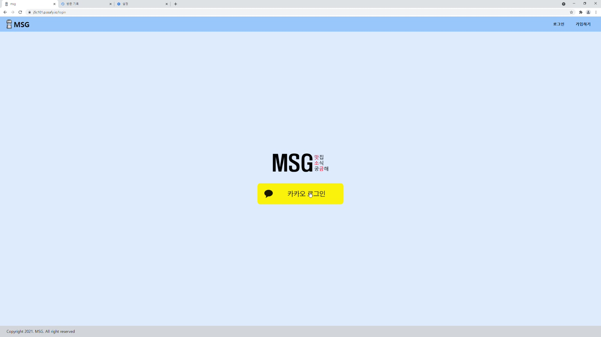

   1 - 2. 로딩
   
   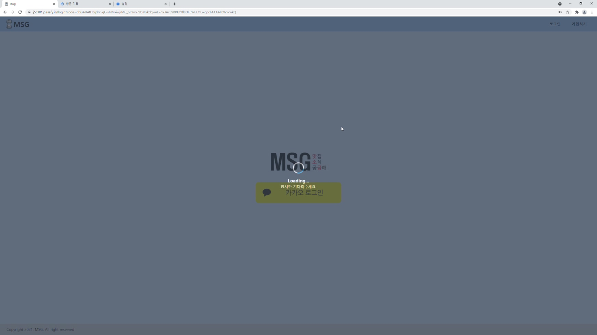
   
   1 - 3. 회원가입
   
   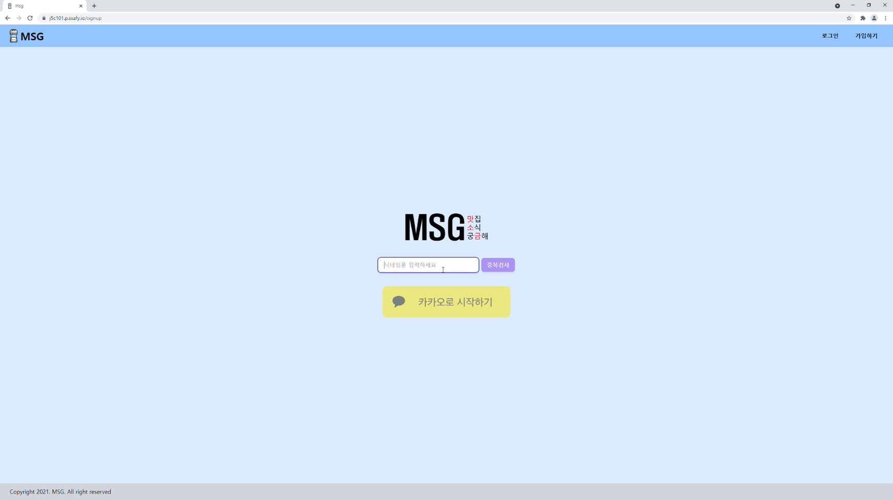
   
   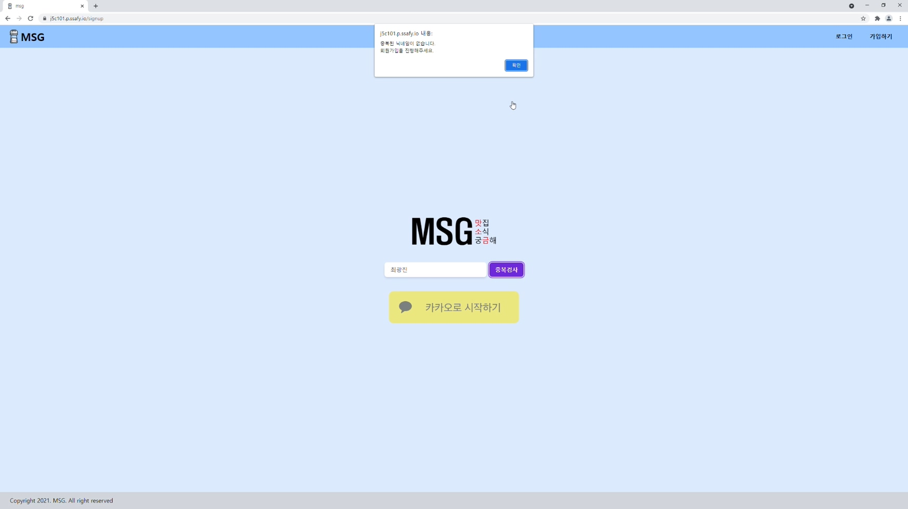
   
2. **분석페이지**

   2 - 0. 메인페이지

   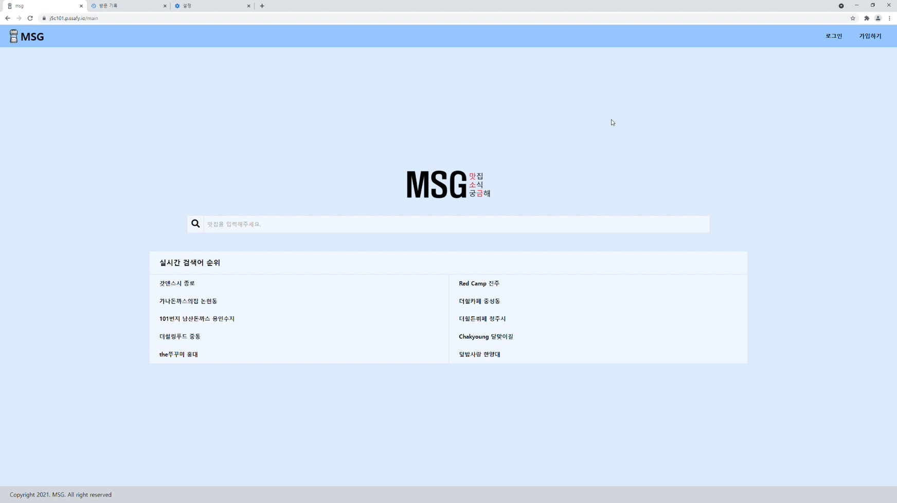

   2 - 1. 키워드 분석

   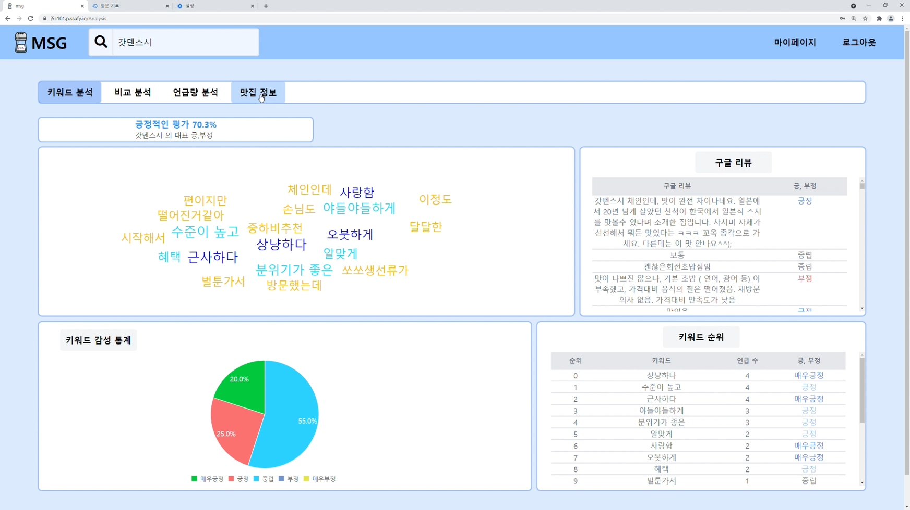

   2 - 2. 비교 분석

   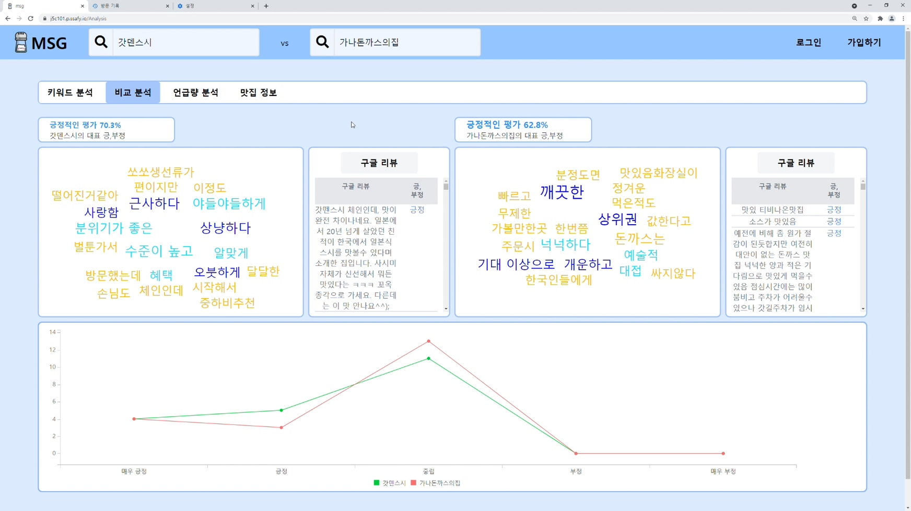

   2 - 3. 언급량 분석

   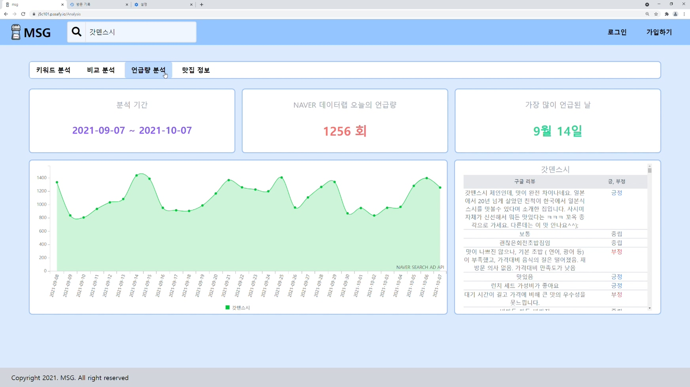

   2 - 4. 맛집 정보

   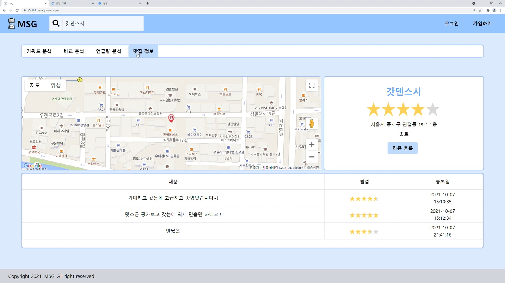

   

3. **리뷰**

   3 - 1. 리뷰 작성

   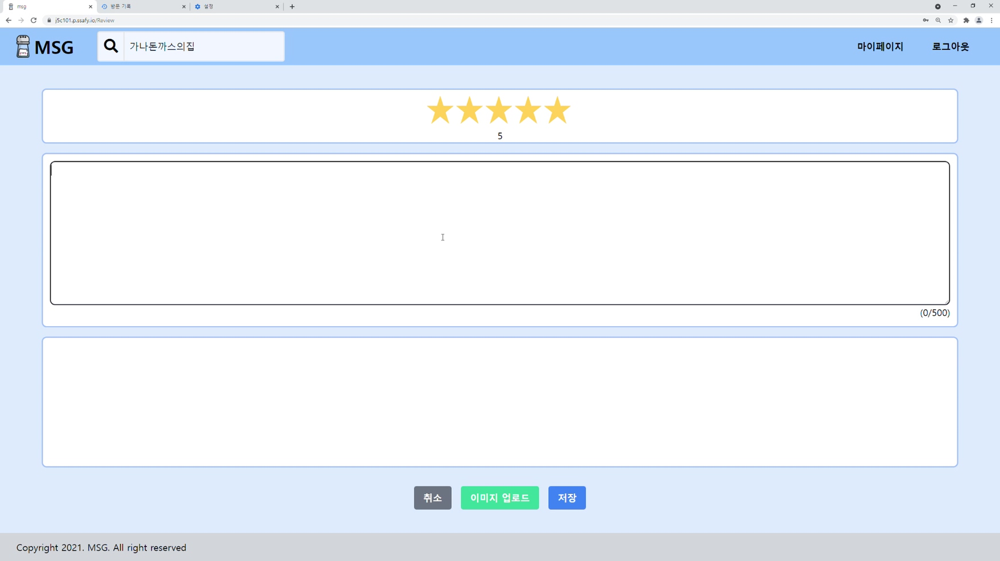

   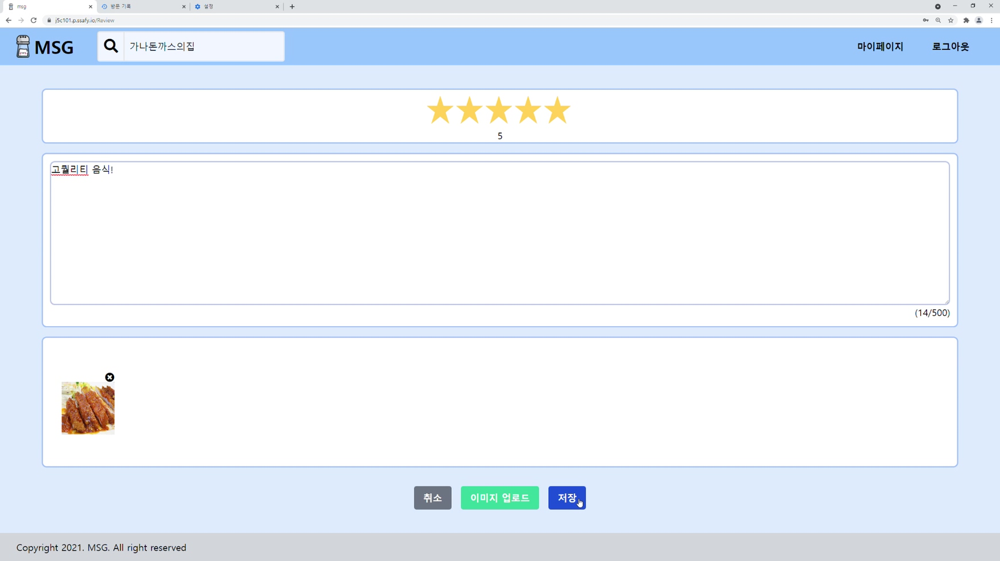

   3 - 2. 리뷰 확인

   ​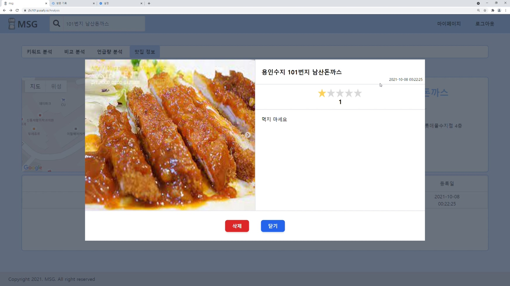

4. **마이 페이지**

   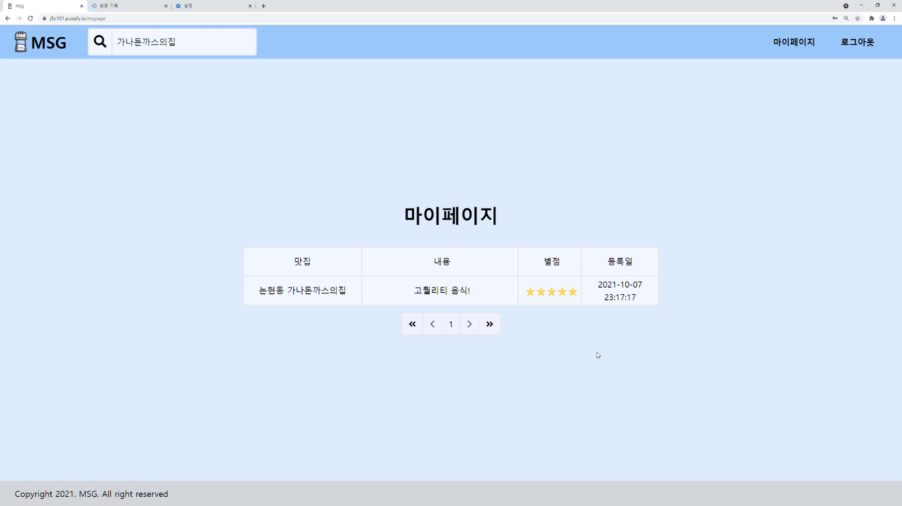

5. **예외 처리**

   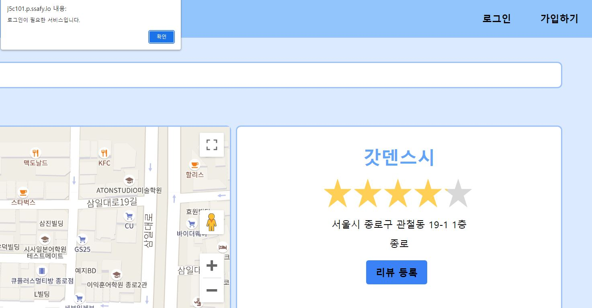

   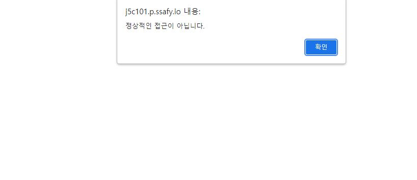

### 세부설명

1. 첫 화면
   1 - 1. 로그인

   - 카카오로 로그인 버튼을 누른다.
   - 카카오톡 계정으로 로그인을 한다. (2단계 인증)

   1 - 2. 로딩 

   * 로딩화면을 기다린다.

   1 - 3. 회원가입 

   * 첫 로그인시 닉네임을 통해 회원가입을 한다.
   * 닉네임 입력 후 중복확인을 한다.
   * 중복이 아닐 경우 start 버튼을 누른다.
   * 메인 페이지로 이동한다.

2. 분석 페이지

   2 - 0. 메인 페이지

   * 상단에 검색바로 맛집 검색이 가능하다
   * 실시간 검색어로 유명 맛집을 찾을 수 있다.

   2 - 1. 키워드 분석

   * 긍정적인 평가 비율을 볼 수 있다

   * 워드 클라우드, 구글 리뷰, 키워드 차트,순위를 볼 수 있다.

   2 - 2. 비교 분석

   * 상단에 또 다른 검색바를 통해 두 맛집을 비교 가능하다

   2 - 3. 언급량 분석

   * Naver AD API 를 통해 언급량 분석 결과를 볼 수 있다.

   2 - 4. 맛집 정보

   * MSG 내부의 리뷰를 확인 가능하다.
   * 구글 맵의 평균 평점을 확인 가능하다.
   * 구글 맵을 통한 위치와 주소를 확인 가능하다.

3. 리뷰

   3 - 1. 리뷰 작성

   * 리뷰를 작성가능하고 별점, 사진 등록, 리뷰등록이 가능하다.

   3 - 2. 리뷰 확인

   * 리뷰를 확인 가능하고, 내가 쓴 리뷰는 삭제 가능하다.

4. 마이페이지

   * 내가 쓴 리뷰를 한번에 확인 가능하다.
   
5. 예외처리

   * 로그인을 안하고 리뷰서비스를 이용하려고 하면 접근이 거부된다.
   * 로그인을 한 상태에서 정상적인 방법으로 접근을 하지 않으면 거부된다.

